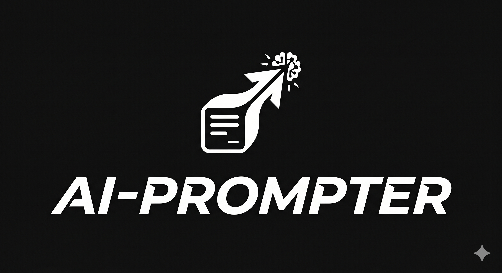

<div align="center">
  
</div>

# AI Prompter (AI 提詞大師) 🎙️

這是一款結合了「即時語音辨識」與「智慧動態滾動」的專業級提詞機應用程式。系統採用 **React + Vite** 打造極簡的毛玻璃 (Glassmorphism) 介面，並透過 **FastAPI** 串接 **Faster-Whisper** 語音辨識模型，實現演講時「你說到哪，提詞機就跟到哪」的無縫體驗。

---

## 🌟 核心特色 (Features)

- **🤖 AI 語音即時跟讀**：系統會透過麥克風即時聆聽您的演講，並運用獨創的「動態滑動視窗」與「Bi-gram 模糊比對」演算法，精準且穩定地將提詞框跳轉至您當前閱讀的段落，徹底解決傳統提詞機必須手動控制速度的痛點。
- **✨ 智慧語意排版系統**：內建一鍵排版工具。只需貼上一長串文稿，系統即會依據字數（最佳 18-26 字）與上下文語意（判斷標點符號的強弱），自動為您將講稿斷句成最適合提詞機閱讀的完美格式。
- **💎 極簡玻璃介面 (Glassmorphism)**：專為演講者設計的沉浸式暗色介面，具備居中對焦框、上下漸層遮罩、以及流暢的轉場動畫。
- **⚙️ 靈活的控制選項**：支援自訂文字大小、自動播放速度調整，並內建**鏡像模式 (Mirror Mode)** 以支援實體分光鏡提詞設備。

---

## 🛠️ 系統架構

本專案分為兩個主要部分：
1. **Frontend (前端)**: `React` + `Vite` + `TailwindCSS`
2. **Backend (後端)**: `Python` + `FastAPI` + `Faster-Whisper` + `WebSockets`

---

## 🚀 快速開始 (Quick Start)

### 1. 後端環境設置 (Backend)

後端負責處理語音串流與 Whisper 模型的即時推論。請確保您的電腦已安裝 Python 與對應的 CUDA 環境（若需使用 GPU 加速）。

```bash
# 進入後端目錄
cd backend

# 安裝依賴套件 (推薦使用虛擬環境)
pip install fastapi uvicorn faster-whisper numpy websockets

# 啟動 FastAPI 伺服器 (預設運行於 http://localhost:8000)
python server.py
```

### 2. 前端環境設置 (Frontend)

前端負責提供使用者介面與麥克風收音。請確保已安裝 Node.js。

```bash
# 進入前端目錄
cd frontend

# 安裝 Node 套件
npm install

# 啟動 Vite 開發伺服器 (預設運行於 http://localhost:5173 或 5174)
npm run dev
```

---

## 📖 使用指南 (How to Use)

1. **開啟網頁**：在瀏覽器中開啟前端伺服器提供的網址（例如 `http://localhost:5173`）。
2. **輸入講稿**：在中央的輸入框中貼上您的演講文稿。
3. **自動排版 (推薦)**：點擊左下角的 `[自動斷句排版]` 按鈕，系統會自動為您把講稿整理成最適合閱讀的短句。
4. **進入提詞**：點擊 `[進入提詞]` 按鈕，畫面將切換至全螢幕提詞模式。
5. **啟動 AI 跟讀**：
   - 點擊底部控制列的 **[AI 跟讀]** 按鈕。
   - 系統會要求麥克風權限，允許後，畫面上方將出現 `LIVE` 指示燈。
   - 開始您的演講！無論您的語速快慢、停頓、甚至手動滾動滑鼠跳段落，AI 都會自動捕捉您的語意並同步捲動。
6. **手動控制**：
   - 您也可以隨時關閉 AI 跟讀，改用一般的 **[播放 (Play)]** 按鍵進行定速捲動。
   - 透過底部滑桿可即時調整「捲動速度 (Speed)」與「文字大小 (Size)」。

---

## 💡 演算法設計理念

- **動態滑動視窗防呆機制**：為了防止演講者說出常見的重複詞彙（如「大家好」）導致提詞機誤判暴衝，系統嚴格限制了 AI 的檢索範圍。它每次只會比對「視覺對焦框內的段落」以及其後續的 2 句不同文稿。
- **無縫手動介入**：在 AI 跟讀途中，若講者突發狀況需要跳過一大段，只需直接用滑鼠滾輪將目標段落滑進「對焦框」，AI 的搜尋起點就會**瞬間與視覺焦點同步**，真正做到人機一體。

---

> **Powered by kesoner & SCUAI**  
> ✉️ 聯絡我們：kesoner666@com
